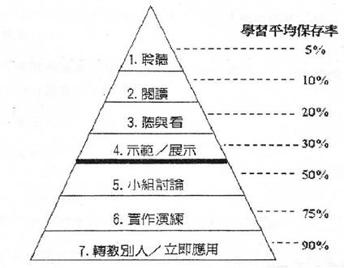

# CH 4 談教學法與資訊編碼

在我剛開始學會講課時，我跟全世界 90% 的老師都一樣。

以為講課就是演講。一天的講課，就是幾個演講加在一起而已。

所以我對學生最大的負責，就是想辦法把精華塞滿投影片、課堂。

不止是身為老師的我這樣認為。其實，連身為學生的人也這樣認為。課堂就是 PPT 塞滿乾貨才算對學生負責。

畢竟，從小到大，我們也沒看過其他教學手法了不是嗎？

## 講述法是最無效的教學法

這樣的認知一直甚至到我成為職業講師後的一年，才被扭轉了。

開始職業教書後一年，我去上了謝文憲、王永福老師開設的講私塾（TTT，Train The Trainer）以及林明樟老師的教材教具設計課以後。才發現原來這世界上有不同的教學法。

不僅教學方法不只一種，連教學方式不同，留存效率也不一樣。

所以，原來我們最依賴的講述法，其實在所有教學方法是最差的。兩週後留存效果只有 5%。

●	全世界的 90% 的人類都以為只有一種教學法
●	講述法
●	講述法對講師最輕鬆
●	對學生最痛苦
●	因為
●	1. 聲音轉碼成概念非常耗功耗
●	2. 許多概念用語音根本講不清楚
●	3. 人的注意力只有 15 分鐘，但卻要被迫聽 45 分鐘
●	4. 如果一邊聽一邊用短期記憶力想，很快就會睡著，或失神
●	5. 不知道自己聽的進度聽到哪裡，也不知道自己進步沒有
●	所以課程要設計過
●	我先上了憲福的 TTT 課與 MJ 的教材教具設計課。
●	後上了 Bob Pike 的 TTT 與 Instructional Design 課。
●	Bob Pike 的課神乎其技。
●	兩天的工作坊讓你學會 50 招教學
●	本來以為虎爛
●	最後一天他要我們驗證是否真是如此
●	後來我去上 Instructional Design 課。
●	發現外國的課是很科學的設計的
●	有教學目標
●	有 15 分鐘劇本
●	有複習。甚至在 15 分鐘內就完成講授、練習、複習。
●	所以很神奇的，你能在兩天裡面上完一堆內容，但全部記得。
●	方法不只是講述
●	還有影音、互動、
●	調用越多感官記得越牢
●	重點要在人類能記憶的黃金窗口，用黃金方式記得
●	知識的傳授方法
●	程序性知識
●	事實性知識
●	概念性知識
●	元知識
●	從程序性知識開始
●	練習程序性知識
●	補充事實性知識、概念知識
●	多次練習程序性知識，而產生元知識
●
