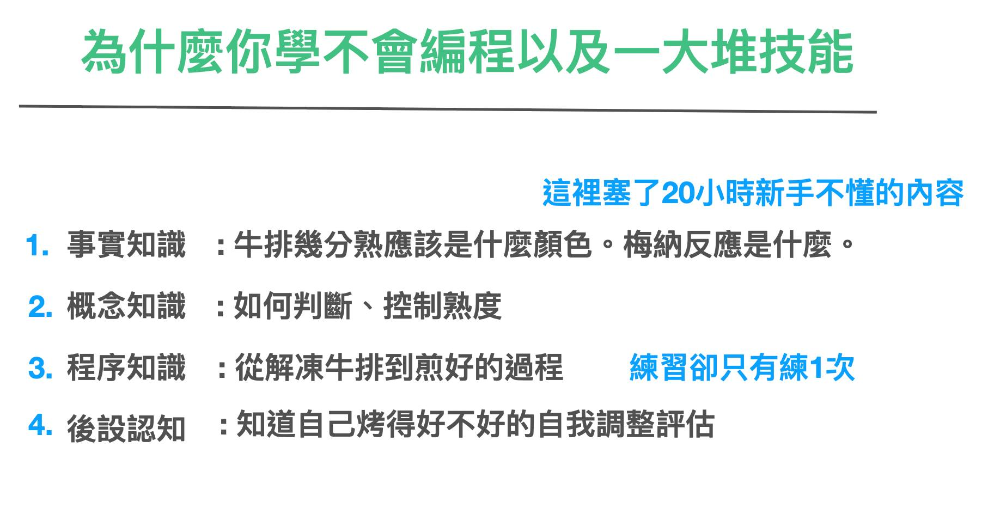

# CH 5 如何有效向老師學技能

相信你看完前面的章節，可能會恍然大悟，原來自己上課愛睡覺，學不會，學完就忘。幾乎都不是自己的問題。

前面四個章節，我們足足花了 20000 字的篇幅抱怨 K12 、爛老師與爛課。

讀者看完來龍去脈後，可能恍然大悟，但又無可奈何。

這些因素都不是我們自己造成的。

難道就這樣沒救了？

相反的。我們花了足足四章這麼大的篇幅鋪陳，只是為了要解開各位對學習的心結，以及在當中穿插出有效學習的基礎原則。

接下來，我們就要介紹如何高效學習。

## Step 1 : 分清楚前輩與老師

高效學習的第一步。就是要找個好老師教你。

我們雖然抱怨了其實市面上這麼多老師不會教書。但事實上，要去學習一門新學問，大概率來說，跟老師學習還是比較快的。

因為能夠作為老師的人，在領域經驗多半還是比我們這些什麼都不懂的人，強上許多的。

我們可以把比你厲害的人分為幾種等級：

* LV 1 只是比你經驗還多的人
* LV 2 有自己獨特做事方法的人
* LV 3 能夠 1 對 1 教人做事方法的人
* LV 4 能夠 1 對 多教方法的人
* Lv 5 能夠 1 對多，還能學成率超高的人
* LV 6 精通領域技術也精通教學方法的人

LV 1-3 我們通稱為前輩，LV 4-6 可以稱之為老師。

所以你可能學不會一門技術，可能是誤把前輩當成了老師。

業界有一個將一個技能的程度類比成階梯式的模型，德雷福斯模型（Dreyfus model of skill acquisition），這個模型將技能熟練度，由上而下分成：專家，精通者，勝任者，高級新手，新手五個等級。

| 德雷福斯模型階段	|業界比例|	經驗值|	不足之處|
| ------------------------------------| --| ------| ----------|
| 新手（初級工程師）novice	        　　　 |   |	 0經驗，只能照 SOP 一步一步做。從輸入x -> y得到運作規則|經常天真的以為看了一本書就得到了武功秘籍　|
| 高級新手（工程師）advanced beginner    |50%|	 懂得基本規則，能夠解決基本問題|	沒有宇宙觀，有些時候向他們解釋基礎原理，還是一知半解　|
| 勝任者（資深工程師）competent          |   |	經驗的程度達到可以把規則融合成自己的模型，獨立解決問題，尋找答案，向專家提問　| |
| 精通者（架構師） proficient		        |10%|	  形成自己的「套路」（自己提煉的架構和方法），設計解法，整體視角思考，熟練運用pattern　| |
| 專家（大神）expert                  	|1%|  	可以運用直覺解決問題，設計架構，交叉學科融合，推進領域發展　| |

甚至我們還得再將之細細區分。為什麼分清楚前輩與老師這麼重要呢？

這是因為我曾經無數聽新手想學寫程式，網上的人劈頭就讓他回去學 C 語言，從「基礎」學起。

而且甚至這些網上的人，還看不起教編程框架或套路的人。為什麼呢？

因為這些人都是「高級新手」。這些人佔據整個業界的比例高達 50% 之多。但是就技能熟練度，他們比起新手沒好去哪裡，什麼都不懂，正在惡補基礎知識的環節。所以，他們才會跟新手說，你得從基礎惡補起。

為什麼沒人跟你說要從框架套路學起呢？

因為知道要從框架學起的至少都是資深工程師了，早有一套套路帶徒弟了，時間也很寶貴，懶得上網跟那些什麼都不懂的噴子爭辯。

但是，身在民主與網路時代。你卻會有個錯覺，好像「多數人」都重複在講的事情才是真的。所以你就誤信了「要從基礎學起」這套說法。反覆在基礎上（語法、名詞上）打轉。最後從入門到放棄。

如果厲害的公司與技術團隊，裡面沒有一套訓練新人的方法，能讓新人從7天就能趕上人家自學一年的進度，那公司是在開慈善的專門幫白紙新手空繳職業上的學費嗎？

所以得千萬分清楚，高級新手、前輩、老師的區別。

## Step 2 : 跟老師學套路

好的老師必然上來就是先教套路。江湖上老師太多了，你可能很難分辨誰好誰壞。

但我必須要說的是，好老師不管他教學技巧好不好，絕對自帶套路。而且絕對從套路開始教。

而所謂的「套路」就是所謂的「程序性知識」。

而這套「程序性知識」，可能是這個老師在該行登峰造極後，將這個行業裡面最常見數十個的場景中重要的知識點，濃縮到一套流程傳授給你。

剛開始你可能跟著做這套套路時，會很矇，甚至錯誤連連。但其實這是正常現象。

就像你第一次烤牛排，不是烤到沒熟，要不然就是全熟硬的跟橡皮一樣。

但這是你學習能力有問題嗎？不是，這是你沒經驗而已。

### 錯誤與反饋

我在教編程的時候，甚至還遇到一種特殊現象。學編程的人，蠻容易遇到挫折的。我跟一個學生聊過以後，才發現是普通人與程式設計師對於「錯誤訊息」的理解不同。

當你在設計程式時，打錯字，現在的編輯器或編譯器，就會爆出紅字，跟你說有錯。程式設計師會理解成是「電腦反饋」「我打錯字」。但是普通人會理解為「我是 Loser，一直出錯」。

因為普通人這輩子沒有面對過這麼頻繁這麼密集的「出現錯誤訊息」。

但是作為程式設計師，我們在編程時，並不是寫程式一次 OK 的。更精確的來說，寫程式一次 OK 的機率是 0%。對，你沒看錯，就是 0%。

絕大多數程式設計師，用的是 Debug-Oriented Programming。就是寫一小段程式，暴力跑。然後看自己有沒有打錯字，打錯字就修錯字。沒錯字再看剛剛寫的這一小段程式（約20-50行）有沒有跑出預期的行為。沒有就修正，如果有就再寫下一段。

所謂的編程行為，是程式設計師不斷的寫很多小代碼，然後組成大塊代碼，然後再重新整理而成。

所以一天吃個 100 個 error 是超正常的。這也是為什麼資訊科系學生，出校園以後學習新語言新框架會特別快。不是因為「他們有基礎」，而是他們心理上可以「無視 Error 帶來的心靈創傷」。

如果初學者不瞭解這一點，在學習編程之路上，會很快的從入門到放棄。

而編程又為什麼那麼難學那麼容易讓人放棄呢？

這是因為很多網上的課程，要不然就是老師不給程式碼，學生必須一幕一幕的按暫停，試圖去跟著老師螢幕上的代碼一行一行敲。所以難免敲錯字。

不然就是老師給的代碼，不是版本環境過時，就是裡面有錯字。學生跑不起來。

如此吃力的學習環境，又沒有成就感，是正常人都放棄。

## Step 3: 跟著套路練三遍

既然這個套路，是老師在該行登峰造極後，將這個行業裡面最常見數十個的場景中重要的知識點，濃縮到一套流程傳授給你。

所以熟練這個套路的流程是非常重要的。

就像是如果你學踢足球，連反覆運球、控球自如都不會，何況帶球射門呢？

但是絕大多數由高級新手設計的爛課程是這樣的。讓新手花了 20 分鐘在理解/背對他們無意義的知識。

等到到練習階段，他們已經沒有興趣練習了。

而甚至多數人，會把「記住知識」當成是「學會技能」。

甚至覺得不練習也無所謂。

所以，這樣怎麼學得會呢？

我們也解釋過，所謂「記住知識」與「學會技能」甚至是不同區域所掌管的，甚至保護留存時間也不一樣。

所以，不練習又怎麼學得會呢？

### 下課馬上練

我有個很好的習慣，就是上完技能課，會視情況情況馬上練一遍，短的技能甚至練三遍。

為什麼會這樣做呢？

這是因為技能的留存，是有時間限制的。

即便老師將厲害的框架教給你，如果你在時限之內不用身體練習，也不應用的話。久了（大概1-2禮拜）就會忘光光。

> 所謂身體的感覺記憶，原理是身體執行動作時，會給神經纖維帶來脈衝。而髓鞘質所謂的記憶神經迴路是電流脈衝傳過神經纖維。髓鞘質是包裹在神經通路外側的一層絕緣物質，當練習用到某部分神經通路時，這部分的髓鞘質就會生長起來。練習得越多，絕緣層越厚，通路中的信息傳遞速度就越快。

這完全是生物學原理。

我在學開車時，被老師稱讚為學車天才。是因為我竟然在 1 小時之內，竟然就能學會「倒車入庫」「S 型轉彎」「路邊停車」。

因為我這輩子沒學過開車，我也不知道開車有多難。所以我用了最保守的方法，就是用身體學車，複製了老師的開法，精確的在場內練習3-4遍。然後老師稱讚我學車很快。當下我也沒多在意。

回來同事問我去駕訓班今天學什麼時，我說我今天學了「倒車入庫」「S 型轉彎」「路邊停車」。他非常吃驚。

因為這三樣一般人至少得學一個禮拜。怎麼開怎麼壓線。我怎麼能在1小時內全學會了。

我才理解到我無意中又用對方法了。因為，開車本身是門技能活，要是用「腦」開車，肯定開到打結了。我猜這也是為什麼這麼多人，學這三樣運車方法，要學這麼久的原因。

### 不要改套路，先照著原樣練三遍

新手在學習時，還有一個學習上的誤區。就是過於心急。

因為人去學一樣技能，往往是要馬上運用。

所以他們的學習方法，就是還沒完整的照著框架至少練 1-2 遍。

就自作聰明的邊學邊改來用。

理論上沒有法律禁止你邊學邊改來用。但實際上這樣學，就很難真的學會。

因為大師這些套路，是他們走過無數的坑，才好不容易設計出來一套完全無坑的套路。

新手可能完全不知道這個領域學習之路多兇險，多充滿地雷。所以往往只要自己一改，就把自己摔到不知道什麼地雷坑裡面了。

搞的自己滿是挫折了。

我通常是學習框架後，繞著路把這條路摸熟了，才會開始魔改。

但這也需要一點耐心。

這裡提供一個有趣的數據。我在訓練學生時，發現10個學生只有1個人會練1遍。而練1遍的人，每10個人裡面，又只會有1個人練第2遍。所以，你只要練三遍，理論上就會贏 100 個人了。

### 不喜歡的知識，也能這樣學會

這個練三遍的經驗，就讓我回想到我學習線性代數的經驗。我在念大學時，雖然我念的是應用數學系。但是我其實對數學沒有那麼大的狂熱。所以對很多學科，都是隨便應付。畢竟，我念這個系其實是想來學編程的。

但是，由於我爸爸希望我在大學後念個碩士。所以我不得不去補習。考碩士時有個學科是線性代數，這門課我在大二時，期中考期末考都只考 20 多分，所以被當了。

所以，我只好在大三時，去參加補習。當時教我的老師，是坊間號稱「線代之神」的黃子嘉老師（現在已故）。我跟著黃老師補一兩個月後，線性代數的功力竟然突飛猛進，大三重修線性代數，期中考竟然考了 80 多分。我的線代老師完全不知道我吃了什麼猛藥。

但是當年跟著黃子嘉老師用他的方式做數學後，我似乎對於線性代數與代數類的數學，竟然開竅，並且產生興趣了。代數與線性代數名字雖然很像。但其實這是完全不同的兩門學科。

對代數重新燃起興趣，本來這門課也被當導致重修的我。在期中考不但是第一個交卷，更是考了 120 分(滿分100，加分題20)
的破表成績。更扯的是，當次全班 60 多人。有超過 40 人考到了 100分。要知道數學系的期中考分數，其實多半全班平均是大約徘徊在 40 分上下的。讓老師懷疑我們全班作弊。

你知道發生了什麼事會變成這樣嗎？

當時因為線性代數的考高分，讓我燃起了對數學的希望。於是我去重讀了代數，用在線性代數學到的解題思維，把代數課本上的習題全做完解開了。不僅如此，我還將所有的習題解題答案，寫成一本冊子。送給友好的同學。吩咐他們，至少把這本冊子抄 1-2 遍。

而老師在期中考時，用的全是課本上的習題，然後做些修改出成考卷。

那些有「抄過」這本冊子幾遍的同學。毫無意外都拿了滿分！

所以自此之後，我就非常喜歡這個練習法，也喜歡寫冊子！

## Step 4: 寫錯題本與 ORID

能夠將一門功夫，練得紮實，並非只光靠練三遍而已。

其實在學校學習時，我是一個上課並不喜歡記筆記的人。

為什麼不喜歡記筆記呢？

理由有幾個：

1. 上課我聽不懂老師講的內容，所以我不知道要選擇聽懂，還是要選擇寫筆記。當我還在猶豫的時候，已經下課了 Orz
2. 我看到其他人寫的筆記都很漂亮，我也想模仿其他人的筆記方法。但是當我忙著用他們的筆記方法抄筆記，下課後我卻什麼都不記得
3. 我如果自己按照自己的方法抄筆記，上面會寫的非常潦草。我又不知道如何整理，也不知道整理有什麼意義。結果就是當期中考前，我看著自己的筆記發呆。只好再去借同學的精美筆記回來惡補。

所以，在 K12 前期，我還能仗著因為教材簡單，且可靠刷題練習，用短期記憶考出高分。

但是在大學這個階段，我就被龐大的知識痛揍，更何況，我念的還是大學數學系。

大學數學系跟高中數學是截然不一樣的「數學」。如果說高中數學可靠刷題過。

那麼大學數學本身可形容為是教你重新思考宇宙萬物的學科，每個數學系的學生，畢業成績都不是太好看，是因為在大二之後，我們學的是「真正」的數學。所謂真正的數學，就是要你學會一套新的邏輯推演方法，去理解數學，去以各種角度去拆解數學問題，甚至證明數學定理。

如果你還用高中數學用短期記憶的方式，那麼肯定會被當到退學。所以能從數學系畢業的人，很多都是人才，沒有人不是被剝了幾層皮才畢業的。

我在打造超人思維裡面，之所以能用有那麼多魔幻角度來拆解問題。

那是因為說穿了，那些看似魔幻的方法，本質是數學上用的解題、拆解、證明手法。

### 開始寫筆記的習慣，改變了我一生

我真正在技術上突飛猛進，是因為在 25 歲遇見了一位前輩。當時前輩在技術上領先我非常多，我當時本身也很崇拜他。

他本身非常喜歡寫筆記，桌上常擺著筆記本，背包也擺著筆記本。口袋甚至還有個小本本。什麼東西都記一下。

我有天就忍不住好奇了。問他為什麼技術這麼厲害了，為什麼還一天到晚記來記去。還有，到底他記東西上有什麼訣竅。

他就說，沒有，他只是怕自己會忘事情，特別是他專長領域是管機器的，有很多瑣碎的東西要記下來。所以，他覺得自己會忘記的事東西，就習慣性寫下來。

他也給我看了他的筆記本，裡面真的沒什麼特別的，甚至只是他一些臨時性的鬼畫符。

我心想，前輩技術都這麼厲害了，還覺得自己會忘東西，所以記筆記。

我這麼廢，怎麼可以不記呢？於是我就也買了筆記本，什麼都記。

開始記筆記之後，雖然我也只是記一些鬼畫符的東西，沒整理，但果然我能記得住的更多了。

後來，我覺得寫筆記速度太慢。於是我就不把東西寫在筆記上了。

我寫在專案管理系統上。專案管理系統，比較像是任務系統。

比較有規模的網路公司，內部都會有專案管理系統，因為一套網站程式，本身可能要多個程序員一起寫，所以內部多會用類似任務系統方式，把工程切碎，發給每個協作的工程師，當做任務解掉。

我們工程師，在寫程式，其實並不像是作家一樣，揮筆而成。

許多在資深工程師等級以下的工程師，更像是 "Google 答案並且拼湊起來"的「組裝工程師」。

聽起來你可能會覺得很廢很難想像。但這卻是實情，行業裡面更多人稱呼自己是 Stackoverflow 工程師。Stackoverflow 是工程師的問答社區。通常我們上 Google 去找實施方案時，最後都會在 Stackoverflow 找到最終答案。所以大家就複製了上面的程式碼，回去拼裝修改。

如果你不是工程師，聽到這件事可能會很震驚。我們工程師卻覺得這根本是行業日常。

●	1. 如何找老師
●	大師課特點
●	速成
●	框架
●	貴
●	快
●	新手也能秒學會
●	大師知道如何將所有知識點濃縮到一整套知識性知識
●	2. 如何跟老師學習
●	程序性知識
●	跟著大師練一遍
●	必定馬上寫作業
●	然後下課練三遍
●	寫錯題本
●	目標下課後2-4week比剛下課時快10倍
●	講述性知識
●	3. 如何訓練自己
●	快 10 倍以後開始問
●	 XXXX 是什麼 ( 可以做什麼）
●	什麼是 XXXX　（底層原理）
●	如何做
●	如何做的更好
●	有什麼不能這樣做嗎？
●	4. 如何取得成就感
●	講述
●	公開發表
