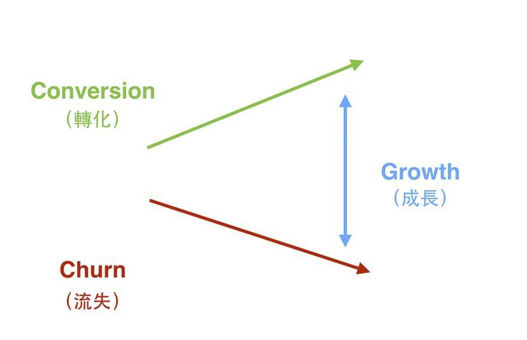
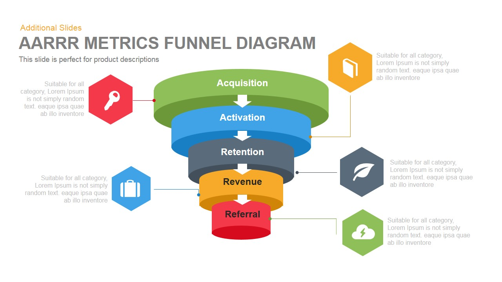
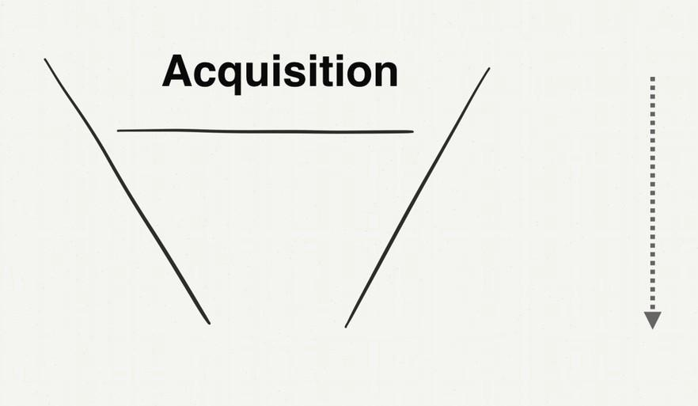
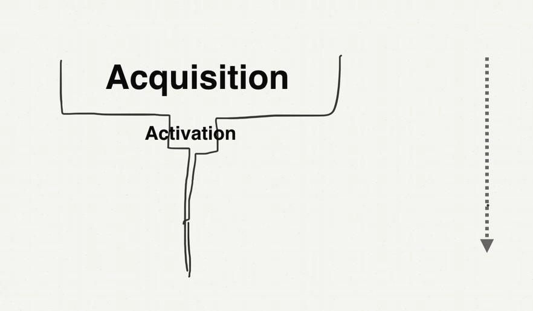

# 如何自學會一門學問

2015 年，我有一門課 "Intro to Growth Hack" 在台灣非常火紅。Growth Hack 這個詞翻成中文，叫增長黑客。是一門在網上用各種技術工具實現業績增長的法門。

因為這門課非常的新，當時在中文世界裡沒有太多材料，但又是一門大家趨之若鶩的技術。

因此當我 2015 年從美國離職回台灣，本來是作個技術圈朋友間的分享會時，不小心課堂就擠爆了。

後來在分享一兩場之後，有個朋友問我，能不能將這門技術也改版成一般人也聽得懂秒懂的課程，我試著嘗試做了一個版本。

沒想到我的教學之路就此點燃...。

當時我只懂講述法，但也抵擋不了大家的熱情，最終這門課因為太火，一個月我得賣兩次門票，一次門票收100人。每次放票在數分鐘之內就被秒殺。半年之內聽過這場演講的人就足足有1500人次。

最後這本書還在一年後變成了一本書 "Growth Hack 這樣做"，而這本書出版沒多久之後，就拿下了金書獎。

## Growth Hack 這樣做其實就是 "代數的習題冊"

為什麼這門課當時這麼熱門呢？其實在我的心目中，這個課跟我之前在大學寫的「代數習題冊」，我平常自己寫的學習筆記沒兩樣。

早在 2013 年，我就在網上看到 Growth Hack 這個詞了。

也想學習，但是網上針對這門學問，根本找不到一本書。都是一篇一篇與焉不詳的英文文章。即便當時有一些行銷人士，做了 Growth Hack 的網課，我也覺得品質很爛，根本沒有回答到我內心想要知道的問題。

身為一個工程師，自學一門學問來說對我不是什麼問題。

因為，我們在編程世界裡，野生程序員也是藉由一篇一篇的文章，想辦法累積這個行業的知識點，並且應用在日常工作中累積出能力的。

在打造超人大腦這本書裡面，我也有分享我怎麼從零學財報分析這門課的過程。這本書，我會利用 Growth Hack 這個主題，再演示一遍。

方法步驟是：

## Step 1：寫下你對這個領域所有的好奇與困惑點(什麼是？與為什麼這很重要？)

當時，最原始基本的第1個問題，就是「Growth 到底是什麼？」

我找了很多基本的資料，在 Standford 的 2014 版 How to Start a Startup 創業課裡面，聽到課程談到了 Growth 最基礎的概念。（也是身為新手的我，我覺得最合理最畫龍點睛的解釋）

> Conversion（轉化） - Churn（流失）=Growth（成長）

指出了增長 Growth 其實是有兩個方向：

1. 增進轉換率
2. 降低流失率

這個解釋我非常能接受。因為我本來以為 Growth 的字面意思就是增長，沒想到也要降低流失率。

接下來，我對這門領域的第2個問題，就是那「Growth Hack 到底是什麼」？

我在維基百科上找到了答案：

> Growth Hack（成長駭客）根據Wikipedia（維基百科）上的定義，可以簡單翻譯如下：「技術創業型團隊，通過數據分析和量化指標，來推廣產品時所使用的一種市場營運技術」。

用白話文翻譯，就是

> 在網上做行銷很難，不像實體店鋪一樣，可以實體拉攏客戶，可以看到客戶逛商品的反應，為什麼不想挑了離開走人，也能追問。但是在網上開店，這些事情都做不到，所以我們要用技術手段去監測客戶行為，在客戶有疑問時幫助他能夠找到想買的商品，解決來店時就有的疑惑。也能偵測自己店鋪上有什麼跳出（導致客戶離開）的問題。

接著，圍繞著 Growth Hack，有一組詞 AARRR 一直不斷的出現。

於是我去查了 「AARRR 到底是什麼？」

我發現 AARRR 的意思是指顧客消費生命週期的五個階段：

> * Acquisition（用戶獲取）
> * Activation (用戶激活）
> * Retention（用戶留存）
> * Revenue（擴大營收）
> * Referral（推薦使用）

接著，下一個問題就是，為什麼知道「AARRR」這麼重要？

我看了很多文章以後，發現了原來我們一般做行銷時，原本對 AARRR 的想像是這樣，以為花大錢灑了廣告費，客戶就會進來：

但實際做生意時，會發生這樣的事。花了大錢打廣告，客戶卻不買單，也沒有複購率：

所以我們才要花時間去改善這個問題，而 Growth Hack 就是在網站上改善這個問題的技術。

所以接下來，我針對 AARRR 這五個環節，又各自提出了相同的問題循環：

#### Acquisition
* 什麼是「Acquisition」？
* 為什麼「Acquisition」很重要？
* 如何做「Acquisition」？
* 如何比第一次做「Acquisition」更快上很多倍？

#### Activation

* 什麼是「Activation」？
* 為什麼「Activation」很重要？
* 如何做「Activation」？
* 如何比第一次做「Activation」更快上很多倍？

#### Retention

* 什麼是「Retention」？
* 為什麼「Retention」很重要？
* 如何做「Retention」？
* 如何比第一次做「Retention」更快上很多倍？

#### Revenue

* 什麼是「Revenue」？
* 為什麼「Revenue」很重要？
* 如何做「Revenue」？
* 如何比第一次做「Revenue」更快上很多倍？

#### Referral

* 什麼是「Referral」？
* 為什麼「Referral」很重要？
* 如何做「Referral」？
* 如何比第一次做「Referral」更快上很多倍？

## Step 2：找到如何做的方法

我在網上經過一番搜索與研究之後。發現了

「Acquisition」與 「Revenue」這兩個主題非常難簡單的研究與總結。

前者「Acquisition」涉及到各個廣告渠道的特性與投放。後者「Revenue」涉及到價格定位設計。

都是超級大的學問。鑽研下去我就迷路了。

於是我直接放棄。先去鑽研有限大的主題：

* Activation (用戶激活）
* Retention （用戶留存）
* Referral（推薦使用）

說是有限大，其實這三個主題也很不小。

只是這三個主題，有明確的範圍、系統化工具、方法論。

再經過一番搜尋與研究以後，我發現：

* Activation (用戶激活），我可以用 Landing Page 解決
* Retention （用戶留存），本質上我可以用 Onboarding 這個概念解決
* Referral（推薦使用），可以用 NPS 這個工具 Debug 客戶滿意度與推薦指數。

搞定這三個主題，整個 Growth Hack 的核心架構就差不多弄通了。

至於 Acquisition 與 Reveune 的問題，可以用錢、外部力量去解決。

所以我集中火力，想辦法把這三個主題，「如何做」的程序式知識找出來，想辦法至少練上一兩遍。

## Step 3: 找到快 10 倍的作法

我還記得我剛學會 Landing Page 的這個工具時，在公司就足足跟同事開會、辯論、實做，足足搞了一個月。搞到最後老闆都嫌怎麼回事。要做一個頁面怎麼要拖上一個月這麼久。

殊不知 Landing Page 牽涉到品牌定位，客戶核心痛點的問題。

有時候，企業走著走著就迷路了，新進的員工根本不知道這間公司原本要解決什麼問題，現在最強的又是解決什麼問題。

一些程序員與設計師，在做網站時只在乎頁面是否好看，根本不在乎網頁上寫的字是否能提高購買率，直擊用戶痛點，吸引下單。

但是，總不能每次做 Landing Page 都這樣搞上一個月。我們還有其他 Landing Page 要做。於是我就在研究，有沒有做 Landing Page，更快的方式。Landing Page 的原理到底是什麼。

後來真讓我去琢磨出一個 Landing Page 快速寫作框架。（作法請見「閃電式開發」一書）

我做一個 Landing Page 的時間從一個月，降到兩週，降到兩天，降到兩小時。

## Step 4: 弄懂底層的原理

再來又要提到 Retention 這門學問。留下用戶並且產生複購行為，是非常難的一門學問。

我買了幾十本講複購的書，每一本書都跟我說要以客為尊，就能產生負購。

這不他媽的等於廢話嗎？

●	寫錯題本
●	目標下課後2-4week比剛下課時快10倍
●	講述性知識
●	3. 如何訓練自己
●	快 10 倍以後開始問
●	 XXXX 是什麼 ( 可以做什麼）
●	什麼是 XXXX　（底層原理）
●	如何做
●	如何做的更好
●	有什麼不能這樣做嗎？
●	4. 如何取得成就感
●	講述
●	公開發表

●	1. 如何選書
●	你看的懂的書。看到就買。大約買 5000 元。不要買很難的。最好買超簡單你看的懂的。
●	2. 如何問問題
●	在紙上寫下你對這個領域的十個基本問題
●	然後把這20本書當作 google 一樣查
●	寫第一本筆記簿
●	接著基於這十個問題的答案，繼續問下 50 個問題。
●	 XXXX 是什麼 ( 可以做什麼）
●	什麼是 XXXX　（底層原理）
●	如何做
●	如何做的更好
●	有什麼不能這樣做嗎？
●	3. 如何快速打下自己第一個基礎
●	組出自己的第一個小框架
●	組出自己的頭三個小框架
●	滾出一個大框架
●	3. 如何加速學習
●	接下來你可以再去買 30-50 本書
●	你會發現基本上你都看懂了

什麼是錯的。
