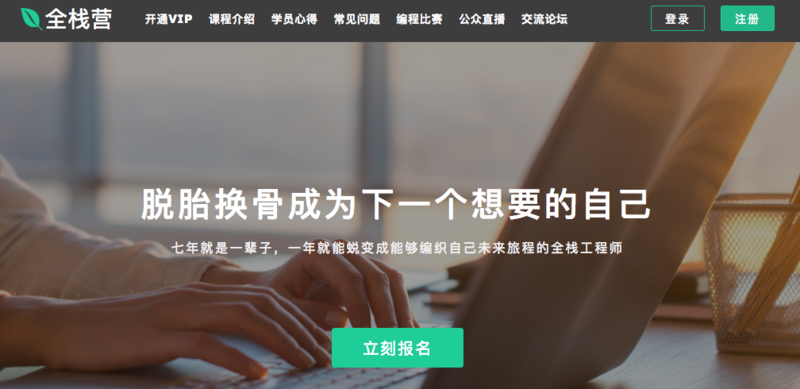
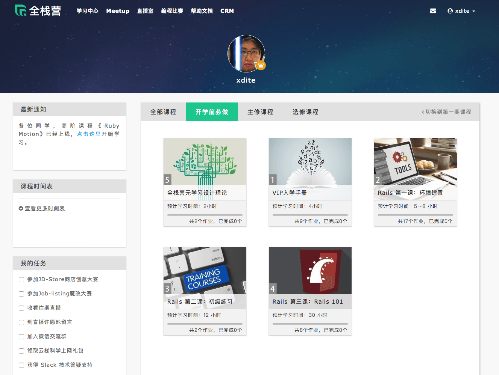
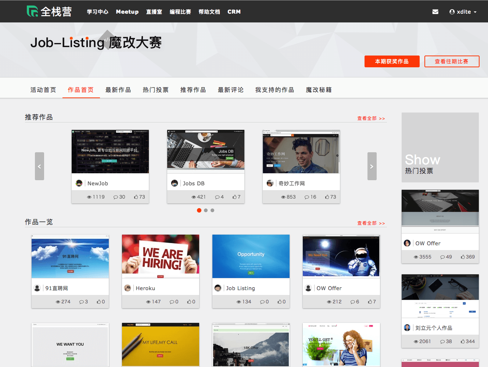
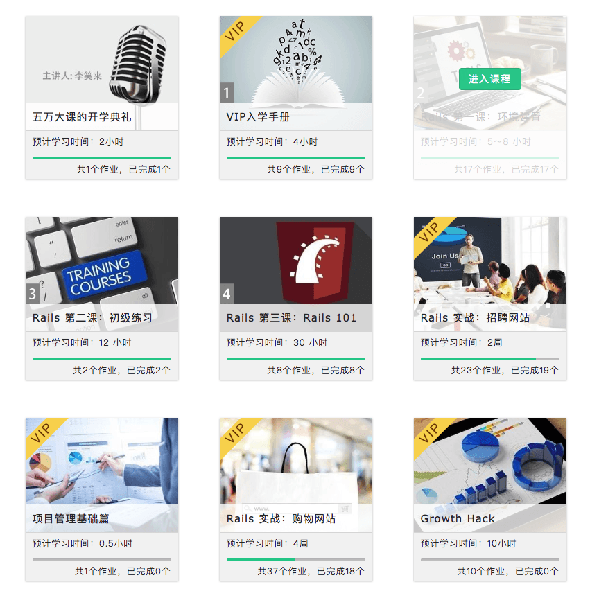
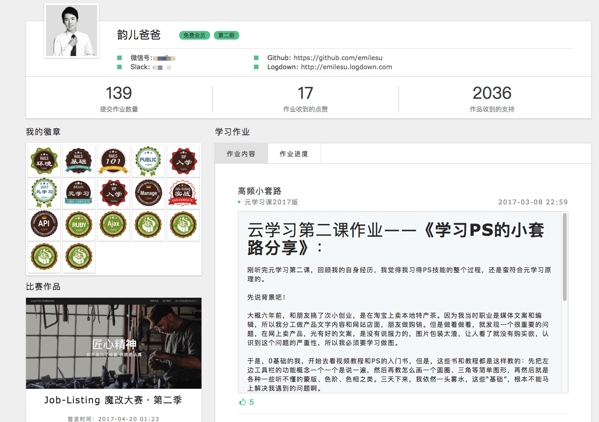
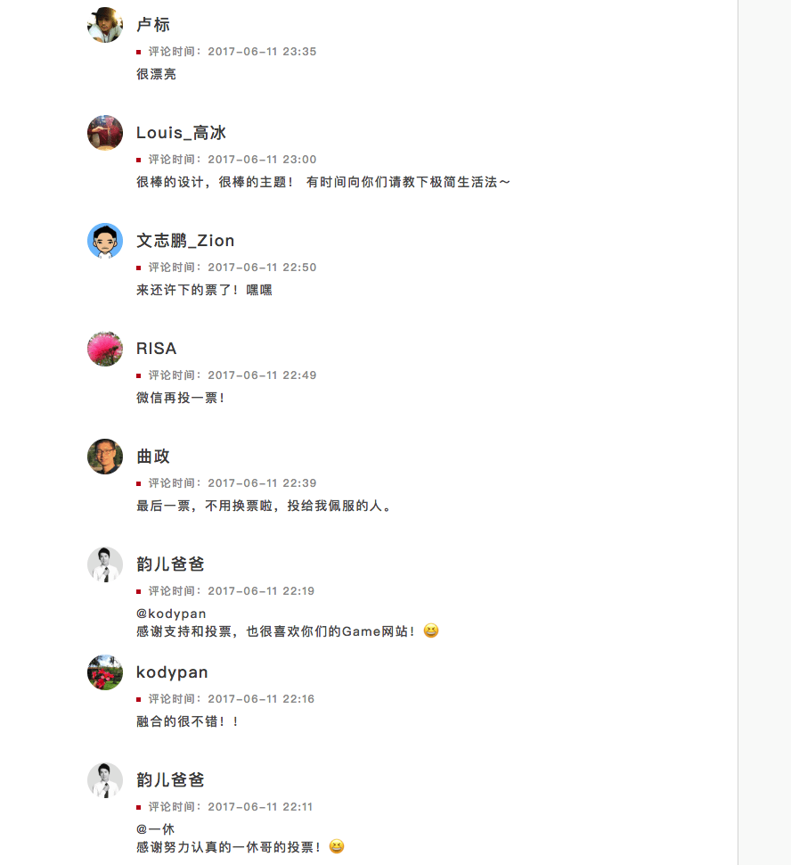

# Ch 8 上癮式學習法(實踐篇)

在 2017 年。我曾經打造過全世界最大的程式在線學習 Codecamp「全棧營」。

這個項目在最後結課時，全程跟完課的學生高達 70%，上課的學生背景都是無計算機背景的小白。

這個 codecamp，時長總共 2 個月。很多學生對於自己能撐過兩個月，甚至還對編程上癮，感到無比神奇。讓我來拆解全棧營是怎麼做到這一點的。

### Stage 1: 目的 --- 史詩意義與使命感 Epic Meaning & Calling

在報名課程之前，我就將這次學習的目標訂為「脫胎換骨成為下一個想要的自己」。明確定義，此次學習目標，是有辦法在一年內練成有辦法自己結合原有興趣並動手實做產品的全棧工程師。

### Stage 2: 遊戲玩法 --- Routine

在課程的一開始前三周，我們設計了幾個教學關卡，讓學生掌握寫網站的基本幾個套路。在這個階段，學生已經有辦法搭起一個簡單的論壇成果。

###
### Stage 3: 第一個小勝利 --- Ah-ha Moment

然後緊接著，我們舉辦了第一次的線上開發大賽。請學生利用前三周的學習，改版成一個有特色的招聘網站。

這個招聘網站的實做難度並不高。難度在於使用者多增添一些特色功能與裝潢自己的網站。

能夠做成這件事讓學生感受到自己也是有能力的

###
### Stage 4: 技能進步 --- 進步與成就感 Development & Accomplishment

在這個過程中，學生可以感受到自己的學習進度。

###
### Stage 5 & 6: 角色養成 --- 所有權與擁有感 Ownership & Possession & 獨特的寶箱獎章 --- 稀缺性與渴望 Scarcity & Impatience

在上課的過程中，參與課程的作業進度，繳交的作業，收穫的獎章，參賽的作品，都會收錄在個人主頁上。

###
### Stage 7 & Stage 8 驚喜的關卡 --- 未知性與好奇心 Unpredictability & Curiosity & 體驗社交分享 --- 社交影響與關聯性 Social Influence & Relatedness

全棧營一期總共有兩次大賽。一次是 Job Listing 大賽，一次是 JDStore 大賽。比賽主要是在挑戰：

* 如何拆分任務以及與隊友偕同合作
* 代碼實做能力（Github 原碼公開）
* 產品完成度
* 人氣度

這個大賽促成了幾件我們意想不到的的結果：

* 同學們互相觀摩 Github 原始碼，互相進行功能上的學習
* 同學們在論壇上，互相分享教程文章，指導其他同學加功能，順便為自己的作品拉票
* 互相在作品頁面上留言打氣
* 學員在拉票與競賽的過程中，互相吸收到陌生人與親友的打氣與幫忙。充滿驚奇與收穫。許多同學甚至上班請假櫓代碼，就為了能專注贏的大賽

## 全棧營學員感想

在第一期全棧營結課後，我收到大約 94 份感想。節錄 4 份收錄在下面：

###
#### 參與全棧學習這麼久，你覺得自己和之前最大的不同是？

1. 對任何新領域新知識的學習，再不懼怕，且有比較明確的方式，通過不斷做小產品，不會通過埋頭坑基礎知識來消耗自己的意志力與對新領域的興趣與好奇心，而是主要以做小東西，讓自己開心為目的，不斷前行，及時在聽到很多牛人前調基礎知識的重要性，我也決定要在保持自己內在戰鬥力和興趣的前提下，去學基礎知識。
2. 解bug的過程中，英文閱讀能力有巨大進步，且萌生了想練英語口語，去國外工作的衝動。
3. 徹底淘汰了過去的垃圾學習方法
4. 發現世界好大，好美麗
###
#### 參與全棧學習這麼久，你覺得自己和之前最大的不同是？

在全棧學習中逐漸習慣了，將自己知道的寫成技術文檔，在這個過程中就是再一次的知識提取。從你以為你明白了，到你真的明白了。以及肌肉記憶到底是個什麼鬼，也終於明白了一些。

最大的不同在於不明白的地方不在過於著急了！也逐漸從有問題問「度娘」，變成了問谷歌。突然感覺世界一下子清楚了不少！

需要學習的東西還有很多 不可能學完就能被外界認可，我們需要再完善自己所欠缺的部分，後端如一些更基礎的內容，前端如html,css,js。希望全棧營的老師們能推出更多優質的教程

###
#### 參與全棧學習這麼久，你覺得自己和之前最大的不同是？

1. 做事前會提前做計劃，並且預留百分之三十的時間。另外會在行動前盤點好手頭資源，每次只做一件事情。
2. 完成比完美重要！不去追求做事的完美，完成第一版之後迅速上線，獲得反饋，用迭代的方法逐步完善作品。
3. 用作品說話！網上的交往作品就是你的名片，因為沒有其他的方法去判斷你，所以如果想讓別人認可你，那就用作品去打動他。
4. 學會與人協作！網絡讓我們可以與世界各地的人建立聯繫，要做一個好的隊友，不要做豬隊友，1➕1的效用遠遠大於2，因為協作會激發每個人的創造性，讓協作體中的每個人變得更好。
###
#### 參與全棧學習這麼久，你覺得自己和之前最大的不同是？

發現「努力做的比上次好」是一件不容易的事情，但是跨國這段不適期，為了更好一些一點點的前進後，整個人都神清氣爽了。會有小夥伴主動來加你，其實是對我的現階段作品的一種肯定。

雖然不一定幫的上他，但是不害怕說「有什麼想要從我作品中學到的效果，儘管問哦！」，能在別人有需求的時候成功幫別人解決，會得到很大的成就感。只是不能每次都迅速跨越。

比以前更坦然的面對自己的無知，並願意跟別人坦然講出自己的短板，講出來後，心理上的壓力會小很多，而且多數情況下會有下一步的思路或得到解決。我獲得了「把自己的不足」講出來的勇氣。
